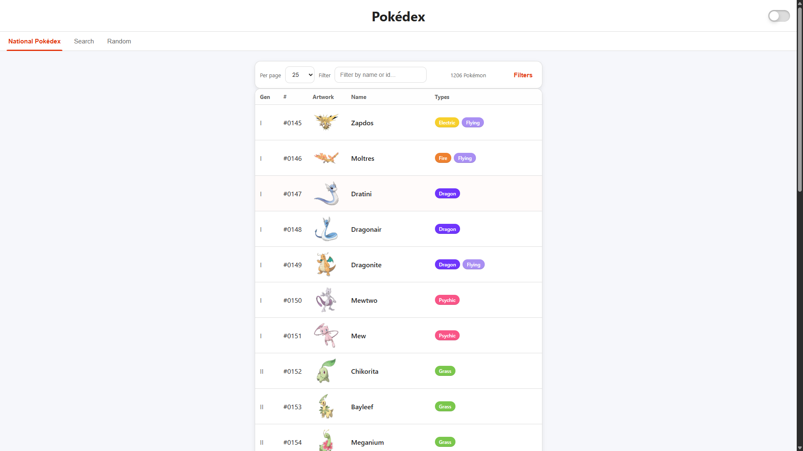
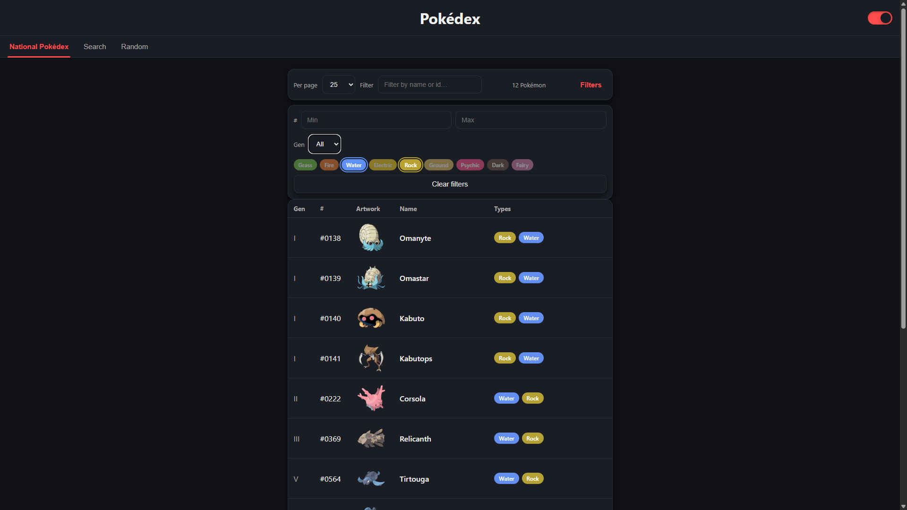
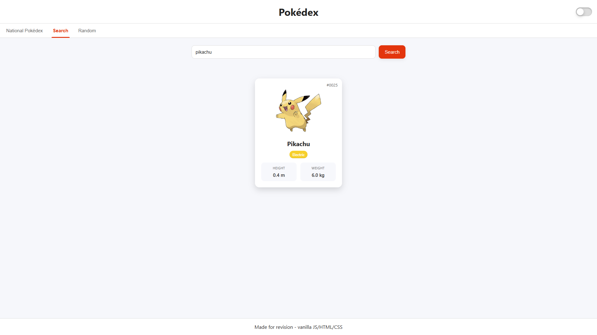
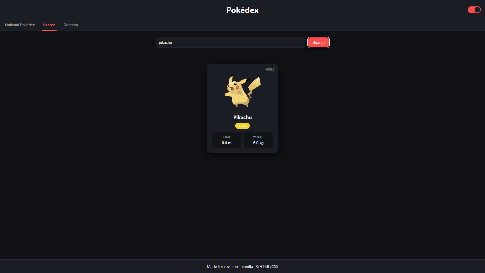
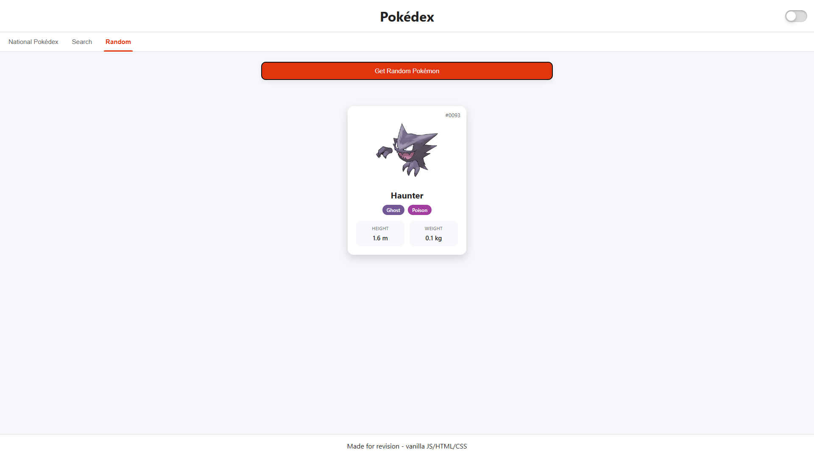
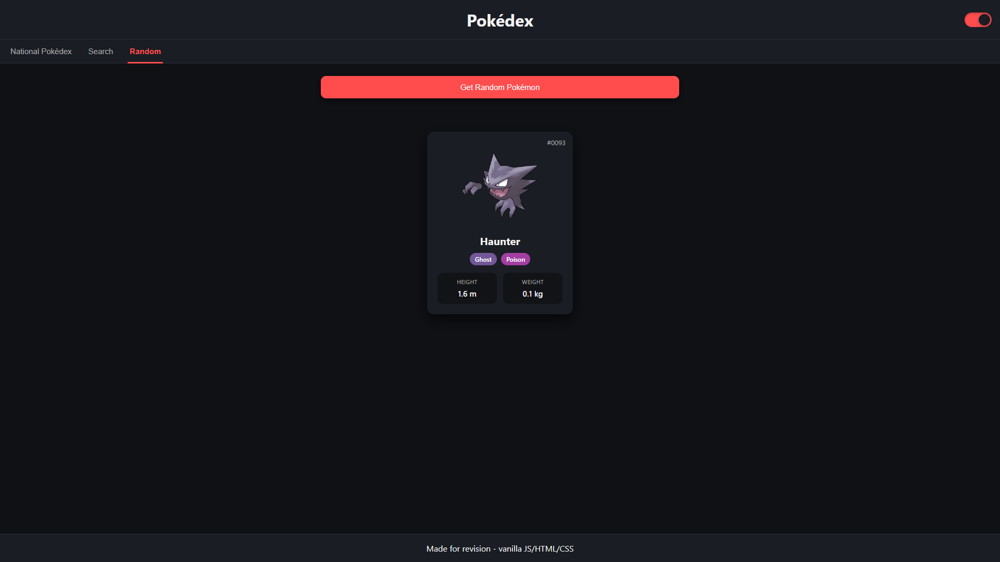
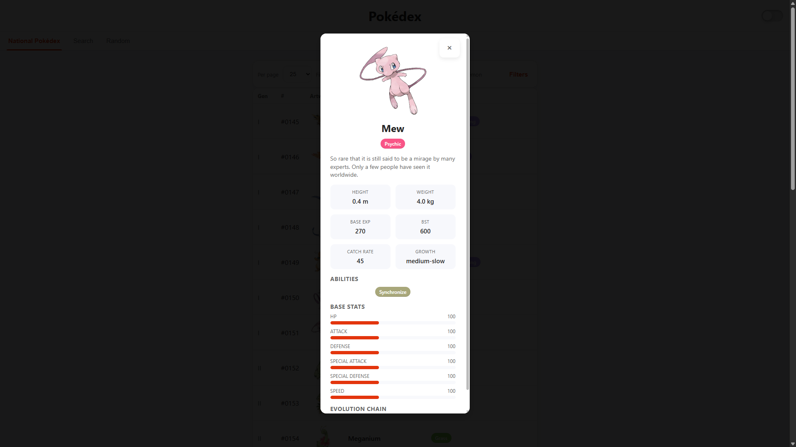
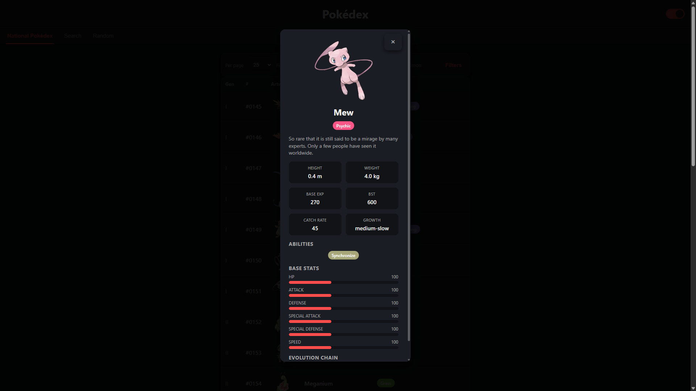

# Pokédex — Technical README

## Overview

This project is a vanilla JavaScript Pokédex built for revision and technical validation purposes. It deliberately avoids frameworks and relies on explicit state management, DOM wiring, and controlled network access to demonstrate clean architecture and predictable behavior.

The application exposes three main views:

* National Pokédex (paginated, filterable table)
* Search (direct lookup)
* Random Pokémon

The two most complex parts of the system are:

1. The National Dex module (pagination + filtering + progressive enrichment)
2. The Pokémon detail modal (multi-endpoint aggregation with cancellation)

This document focuses strictly on those two areas.

---

## Architectural Principles

* Vanilla JS only (no framework, no virtual DOM)
* Explicit, centralized state objects
* Progressive rendering: show something immediately, enrich later
* Deterministic pagination and filtering
* Abortable fetches to prevent race conditions
* DOM validation at startup to fail fast

---
## Screenshots

The following screenshots illustrate the main views of the application.
Each view is shown in both light and dark themes to demonstrate the
theme system and layout consistency.

### National Pokédex

Light theme:



Dark theme:



---

### Search View

Light theme:



Dark theme:



---

### Random Pokémon View

Light theme:



Dark theme:



---

### Pokémon Detail Modal

Light theme:



Dark theme:



---

## National Dex Module

### Responsibility

The National Dex module is responsible for:

* Fetching the full Pokémon index once
* Rendering a paginated table
* Applying multiple independent filters
* Lazily enriching rows with extra data (types, artwork, generation)
* Keeping pagination stable and predictable

It does **not**:

* Fetch full Pokémon details eagerly
* Re-fetch already cached data
* Mutate DOM outside its own scope

---

### Core State

The entire module is driven by a single state object:

* `all`: raw Pokémon list (name + id)
* `filtered`: result of applying filters to `all`
* `page`, `pageSize`: pagination state
* `filters`: user-defined constraints
* `cache`: per-Pokémon detail cache (types, artwork, id)
* `genMap`: per-Pokémon generation cache
* `abort`: active AbortController for in-flight requests

This guarantees that rendering is always derived from state, never the DOM.

---

### Data Flow

Initialization:

1. Fetch `/pokemon?limit=2000`
2. Extract `{ name, idFromUrl }`
3. Store once in `dexState.all`

Rendering a page:

1. Cancel previous render if still running
2. Ensure filter-dependent data exists
3. Apply filters to `all` → `filtered`
4. Clamp page bounds
5. Render table rows immediately
6. Enrich visible rows (details + generation)
7. Re-render rows and pagination

This two-pass render ensures fast perceived performance.

---

### Filtering Strategy

Filtering is deterministic and order-independent.

Supported filters:

* Text (name or exact id)
* ID range
* Generation
* Types (up to 2, AND logic)

Important rules:

* Filters never mutate `all`
* Filters operate only on cached data
* Missing data causes temporary exclusion until enriched

When a filter requires unavailable data (generation or types), the module:

* Identifies candidate Pokémon
* Fetches only what is missing
* Re-applies filters

---

### Pagination Logic

Pagination is entirely state-driven.

Key invariants:

* `filtered` is the single source of truth
* Page clamping always occurs after filtering
* Page resets occur only when filters or page size change

The pager UI is computed via a sliding window:

* Always shows current page context
* Uses ellipsis for large ranges
* Never renders invalid page numbers

Event handlers never directly touch the DOM; they only mutate state and re-render.

---

### Abort Handling

Every render cycle creates a new `AbortController`.

If a new render starts:

* The previous controller is aborted
* All pending fetches are cancelled

This prevents:

* Race conditions
* Late responses overwriting newer state
* UI flicker

---

## Pokémon Detail Modal

### Responsibility

The modal is responsible for:

* Displaying a complete Pokémon profile
* Aggregating data from multiple endpoints
* Handling open/close lifecycle cleanly

It does **not**:

* Cache data globally
* Interact with pagination or filters
* Persist state across openings

---

### Data Sources

Opening the modal triggers three sequential fetches:

1. `/pokemon/{id|name}`
2. `pokemon.species.url`
3. `species.evolution_chain.url`

These are intentionally chained to preserve logical dependency.

---

### Abort Strategy

The modal maintains its own `AbortController`.

Rules:

* Opening a modal aborts any previous modal request
* Closing the modal aborts active requests
* Escape key and backdrop click are supported

This guarantees that stale responses never update the modal content.

---

### Rendering Strategy

Rendering is done in a single pass once all data is available.

Computed values:

* Height and weight normalized to meters / kilograms
* Base stat total (BST)
* English flavor text extraction
* Evolution chain flattened to a linear sequence

No incremental rendering is used here by design, since the modal is explicitly user-triggered.

---

## Error and Loading Handling

Both modules rely on shared helpers:

* `setLoading(true|false)` for global UI feedback
* `setError(message)` for non-fatal failures

Errors:

* Do not crash the app
* Do not leave partial UI states
* Always reset loading indicators

---

## Why This Design

This architecture prioritizes:

* Predictability over cleverness
* Explicit state over implicit DOM coupling
* Debuggability over abstraction

It is intentionally verbose to make data flow and responsibilities obvious, which is the primary goal of this project.

---

## Scope Limitations

Deliberately excluded:

* Global caching across views
* URL routing
* Framework abstractions
* Optimistic rendering

These omissions are intentional and align with the educational and validation goals of the project.

## CSS Architecture (Vanilla, Theme-Driven)

This project intentionally uses **plain CSS without preprocessors or frameworks**. The styling layer is designed to be predictable, debuggable, and easy to reason about in an academic or interview context.

### Design Tokens via CSS Variables

All theming is centralized using CSS custom properties defined on `:root` and overridden via the `html[data-theme="dark"]` attribute.

This provides:

* Zero-JS theming logic (only a DOM attribute toggle)
* No duplicated color definitions
* Instant theme switching without reflow-heavy class rewrites

Variables cover:

* Background / surface colors
* Text and muted text
* Accent and accent-soft colors
* Borders, radii, and shadows

The CSS variable `--value` is reserved exclusively for stat bar rendering and is intentionally scoped for that single responsibility.

### Component-Oriented Styling

Although no CSS framework is used, styles are organized by **visual responsibility**:

* Layout (header, footer, container)
* Controls (inputs, buttons, switches)
* Reusable primitives (cards, pills, tables)
* Feature-specific blocks (National Dex, modal, pager)

Each section is clearly delimited using comment banners to keep the file readable despite being a single stylesheet.

### Pokémon Type System

Pokémon type colors are implemented using data attributes and CSS variables:

```
.type[data-type="fire"] { --type-color: #EE8130; }
```

This avoids:

* Hardcoded class-per-type styling
* Inline styles
* JavaScript-driven color logic

The same `.type` primitive is reused across cards, tables, filters, and the modal.

### Progressive Enhancement

CSS features such as `color-mix`, `tabular-nums`, and custom scrollbars are used where supported, but the UI remains functional without them.

No critical behavior depends on advanced CSS features.

## Single-Page Application Behavior

The application behaves as a **lightweight SPA** without routing libraries or virtual DOM abstractions.

### View Switching

The three main views (Search, Random, National Pokédex) are always present in the DOM.

Navigation works by:

* Toggling a `.hidden` class on sections
* Updating tab active states and ARIA attributes

This approach:

* Avoids re-creating DOM nodes
* Preserves local UI state
* Keeps logic simple and explicit

### Modal as an Overlay Layer

The Pokémon detail view is implemented as a fixed overlay rather than a route change.

Key behaviors:

* Blocks background interaction
* Closes on backdrop click or Escape key
* Uses its own scroll context with custom scrollbar styling

No history manipulation is performed; the modal is a pure UI layer.

### No Global State Manager

State is localized per module:

* National Dex manages its own filtering, pagination, and caches
* Search and Random views are independent
* The modal owns its own fetch lifecycle

This avoids unnecessary coupling while keeping data flow easy to trace.

## Intentional Simplicity

The structure of this project is intentionally conservative:

* No build step
* No CSS framework
* No state library
* No router

This is a deliberate choice to:

* Emphasize core JavaScript and DOM skills
* Keep logic transparent for evaluation
* Reduce cognitive overhead when reading the code

Every abstraction present in the codebase exists to solve a concrete problem and can be justified line by line.
